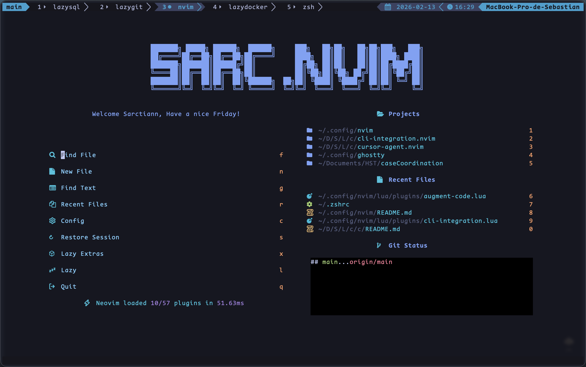

# Sarctiann NVIM Setup

> A Neovim configuration based on [LazyVim](https://github.com/LazyVim/LazyVim), optimized for developers transitioning from VSCode who love terminal interfaces.

## Table of Contents

- [Description](#description)
- [Features](#features)
- [Screenshot](#screenshot)
- [Requirements](#requirements)
- [Installation](#installation)
- [Key Plugins](#key-plugins)
- [Recommendations](#recommendations)
- [Documentation](#documentation)

---

## Description

--
This Neovim configuration is designed for developers who are making the transition from VSCode to Neovim. LazyVim provides an excellent balance between familiar VSCode workflows and the power of a terminal-based editor.

As a macOS and Linux user, I have a strong affinity for terminal interfaces and TUI (Text User Interface) applications. This setup aims to provide an intuitive way to accomplish what you were already doing in VSCode, but with all the flavor and efficiency of a well-configured TUI.

**Who is this for?**

- **VSCode users** looking to explore Neovim while maintaining familiar workflows
- **Terminal enthusiasts** who prefer TUI applications
- **Developers** working on macOS or Linux systems
- **Those seeking** a modern Neovim distribution with sensible defaults

---

## Features

- 🚀 **LazyVim-based**: Built on top of the popular LazyVim distribution
- 🎨 **Modern UI**: Tokyo Night colorscheme with transparent backgrounds
- 🤖 **AI Integration**:
  - Cursor Agent for AI-powered assistance
  - Augment Code for intelligent code suggestions
  - Blink.cmp for enhanced autocompletion
- 💾 **Auto-save**: Automatic file saving with VSCode-like behavior
- 📝 **Multiple Language Support**: Comprehensive LSP support for various languages
- 🎯 **VSCode-like Experience**: Keybindings and workflows familiar to VSCode users
- 🔧 **Highly Customizable**: Easy to modify and extend
- 🌐 **Cross-platform**: Works on macOS and Linux

---

## Screenshot



---

## Requirements

Before installing this configuration, ensure you have:

- **Neovim** (version 0.9.0 or higher)
- **Git** (for cloning the repository and plugin management)
- **A terminal emulator** (Alacritty recommended, see [Recommendations](#recommendations))
- **A Nerd Font** (CodeNewRoman NF recommended, see [Recommendations](#recommendations))

### Optional Dependencies

- **Node.js** (for some language servers and plugins)
- **Python** (for Python language support)
- **Rust** (for Rust language support and some plugins)

---

## Installation

### Quick Start

1. **Backup your existing Neovim configuration** (if you have one):

   ```bash
   mv ~/.config/nvim ~/.config/nvim.backup
   ```

2. **Clone this repository**:

   ```bash
   git clone https://github.com/Sarctiann/nvim-config.git ~/.config/nvim
   ```

3. **Start Neovim**:

   ```bash
   nvim
   ```

4. **Wait for plugins to install**: LazyVim will automatically install all plugins on first launch.

### Detailed Installation

For a deeper understanding of the installation process or if you want to start your own setup, please refer to the [LazyVim documentation](https://lazyvim.github.io/installation).

---

## Key Plugins

### AI & Code Assistance

- **[cursor-agent.nvim](https://github.com/Sarctiann/cursor-agent.nvim)**: AI-powered code assistance with custom mappings
- **[augment-code](https://github.com/augmentcode/augment.vim)**: Intelligent code suggestions and completions
- **[blink.cmp](https://github.com/saghen/blink.cmp)**: Enhanced autocompletion engine with emoji support

### Editor Enhancements

- **[auto-save.nvim](https://github.com/okuuva/auto-save.nvim)**: Automatic file saving with VSCode-like behavior
- **[flash.nvim](https://github.com/folke/flash.nvim)**: Enhanced navigation with labels
- **[mini-surround](https://github.com/echasnovski/mini.nvim)**: Surround text objects
- **[mini-diff](https://github.com/echasnovski/mini.nvim)**: Inline diff indicators

### UI & Visual

- **[tokyonight.nvim](https://github.com/folke/tokyonight.nvim)**: Beautiful colorscheme (Night variant)
- **[neo-tree.nvim](https://github.com/nvim-neo-tree/neo-tree.nvim)**: File explorer
- **[codewindow.nvim](https://github.com/gorbit99/codewindow.nvim)**: Code minimap
- **[mini-indentscope](https://github.com/echasnovski/mini.nvim)**: Indentation guides

### Utilities

- **[snacks.nvim](https://github.com/folke/snacks.nvim)**: Enhanced terminal and UI utilities
- **[colorizer.nvim](https://github.com/norcalli/nvim-colorizer.lua)**: Color highlighter
- **[blamer.nvim](https://github.com/APZelos/blamer.nvim)**: Git blame annotations

---

## Recommendations

To get the most out of this Neovim configuration, I recommend using these complementary tools:

### Terminal Emulators

- **[Ghostty](https://github.com/ghostty-org/ghostty)** - Cross-platform terminal emulator
  - [My Ghostty Config](https://github.com/Sarctiann/my_ghostty_config)

- **[Wezterm](https://github.com/wez/wezterm)** - GPU-accelerated cross-platform terminal
  - [My Wezterm Config](https://github.com/Sarctiann/my_wezterm_config)

- **[Alacritty](https://github.com/alacritty/alacritty)** - Fast, GPU-accelerated terminal
  - [My Alacritty Config](https://github.com/Sarctiann/alacritty_config)

### Terminal Multiplexer

- **[tmux](https://github.com/tmux/tmux)** - Terminal multiplexer
  - [My tmux Config](https://gist.github.com/Sarctiann/1011e0527dfef5f7ae270721e1a21080)

### Shell Configuration

- **[My Zsh Config](https://github.com/Sarctiann/my_zsh_conf)** - Custom zsh configuration (no oh-my-zsh)

### Fonts

- **[CodeNewRoman NF](https://www.nerdfonts.com/font-downloads)** - Nerd Font variant for icons and symbols

---

## Documentation

### LazyVim Resources

- [Official LazyVim Documentation](https://lazyvim.github.io/installation)
- [LazyVim GitHub Repository](https://github.com/LazyVim/LazyVim)
- [LazyVim Keybindings](https://www.lazyvim.org/keymaps)

### Neovim Resources

- [Neovim Documentation](https://neovim.io/doc/)
- [Neovim GitHub Repository](https://github.com/neovim/neovim)

### Custom Keybindings

Some notable custom keybindings in this configuration:

- `<M-Up>/<M-Down>`: Move lines up/down (works in normal, insert, and visual modes)
- `<leader>fm`: Open or create today's markdown note
- `<leader>od`: Open LazyDocker (if installed)
- `<leader>ct`: Convert JSON to TypeScript types
- `<leader>fC`: Toggle Ghostty config files
- `<leader>gm`: Navigate to next git merge conflict marker
- `<leader>bQ`: Delete all buffers

For a complete list of keybindings, check the LazyVim documentation or use `<leader>?` in Neovim.

---

## License

This configuration is open source. Feel free to use, modify, and distribute as needed.

---

## Contributing

Contributions, issues, and feature requests are welcome! Feel free to check the [issues page](https://github.com/Sarctiann/nvim-config/issues).

---

**Enjoy your Neovim journey! 🚀**
